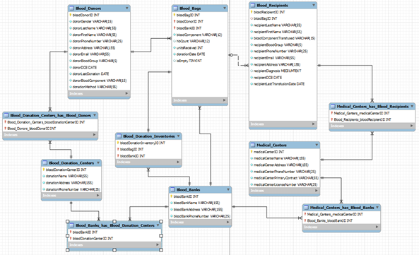
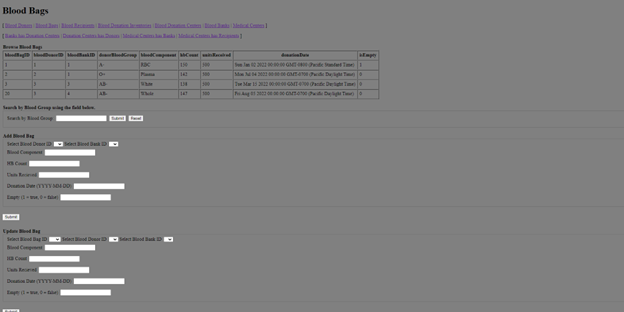
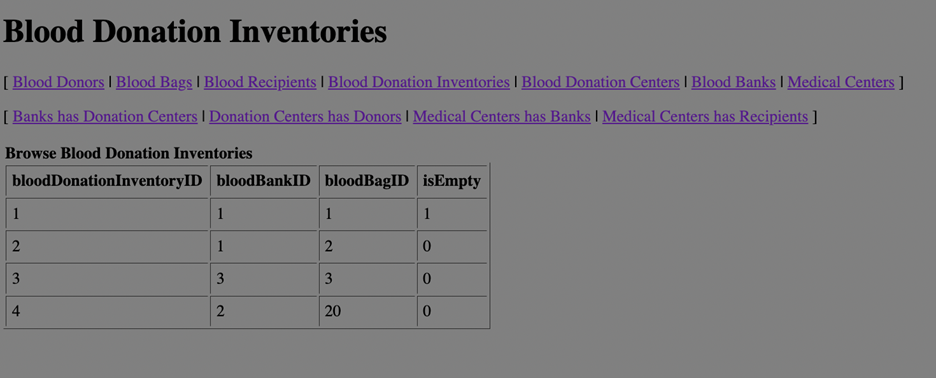

# CS 340 Introduction to Databases
Website with CRUD implementation for blood donation inventory database  

## Assignment Info
- Your database should be pre-populated with sample data. At least three rows per table is expected. The sample data should illustrate a table's functionality, e.g. if the table is part of a many-to-many relationship, the sample data should depict M:M.
- Your database should have at least 4 entities and at least 4 relationships, one of which must be a many-to-many relationship.  The entities and relationships should implement the operational requirements of your project.
- You are creating a web interface for data tables, so the primary user is the administrator of this database.
  - It is NOT a customer facing website; thus there is no need for login page; sessions; register/password; shopping cart; check-out; etc.  While having those pages would be helpful in many customer facing applications, the purpose of this project is to provide a UI for your tables. 
  - Put another way, if you had 4 entities that were implemented as 5 tables in a database, then we expect roughly 5 web app pages as a front end for each of the 5 tables in your database.
  - One exception is oftentimes it works better for the UX to have a single web page for a Many-to-Many relationship between 2 tables (so the user doesn't have to view two pages to complete a transaction in both tables). So in that case if you had 4 entities that were implemented as 5 tables, with 1 many-to-many relationship between 2 of those tables, and the 2 tables in that m:m were managed on a single web page, then we expect 4 web pages in the project. 
  - Some students may choose to add a home page to their project, which is acceptable but not required. To continue the example from the previous item, adding a home page would be a 5th page in the project. 
- It should be possible to INSERT entries into every table individually.
- Every table should be used in at least one SELECT query. For the SELECT queries, it is fine to just display the content of the tables, but your website needs to also have the ability to search using text or filter using a dynamically populated list of properties. This search/filter functionality should be present for at least one entity. It is generally not appropriate to have only a single query that joins all tables and displays them.
- You need to include one DELETE and one UPDATE function in your website, for any one of the entities. In addition, it should be possible to add and remove things from at least one many-to-many relationship and it should be possible to add things to all relationships. This means you need INSERT functionality for all relationships as well as entities. And DELETE for at least one many-to-many relationship.
- Note that it's really not acceptable to have the user enter IDs for foreign keys. You may implement a drop-down menu or something similar but should not have the user enter the ID manually. 
- In a one-to-many relationship, you should be able to set the foreign key value to NULL, that removes the relationship. In case none of the one-to-many relationships in your database has partial participation, you would need to change that to make sure they can have NULL values.
- In a many-to-many relationship, one should be able to delete a row from the intersection table without creating a data anomaly in the related tables. If you implement DELETE functionality on at least ( 1 ) many - to - many relationship table , such that the rows in the relevant entity tables are not impacted , that is sufficient.
- To continue the example from above, if you have 5 tables in your schema, then at a minimum, we expect you to implement 5 SELECTs, 5 INSERTs, 1 UPDATE (M:M), 1 DELETE (M:M), 1 NULLable relationship, and 1 Search/Dynamic for a total of 14 functions. 

## Screenshots
Entity-Relationship Diagram  
  
Blood Bag Page  
  
Donation Inventory Page  

